# DjangoBlog - Deploy on EC2: Manual AWS EC2 Deployment

[Back](../../README.md)

- [DjangoBlog - Deploy on EC2: Manual AWS EC2 Deployment](#djangoblog---deploy-on-ec2-manual-aws-ec2-deployment)
  - [Introduction](#introduction)
  - [Setting Up an EC2 Instance as a Server](#setting-up-an-ec2-instance-as-a-server)
  - [Connect to the EC2 Instance and Load Django Code](#connect-to-the-ec2-instance-and-load-django-code)
  - [Configure Deployment: Nginx + Gunicorn + Supervisor](#configure-deployment-nginx--gunicorn--supervisor)
    - [Install and Configure `Gunicorn`](#install-and-configure-gunicorn)
    - [Install and Configure `Nginx`](#install-and-configure-nginx)
    - [Install and Configure `Supervisor`](#install-and-configure-supervisor)
    - [Access the Application Using Public IP](#access-the-application-using-public-ip)
  - [Routing Traffic to an EC2 Using Route53](#routing-traffic-to-an-ec2-using-route53)
  - [Summary](#summary)

---

## Introduction

This document outlines the process of deploying a Django blog application to an `AWS EC2` instance manually. It covers setting up the EC2 instance with the Ubuntu operating system, configuring deployment using `Gunicorn`, `Nginx`, and `Supervisor`, and routing traffic to the EC2 instance using `Route53`.

The instructions detail each step, including setting up a virtual environment, installing dependencies, configuring the Django application, and applying necessary network and server configurations. The document also includes testing and troubleshooting steps, ensuring the successful deployment and operation of the blog application.

---

## Setting Up an EC2 Instance as a Server

Create an EC2 instance from an EC2 template, using a general-purpose template with the Ubuntu operating system.

- To select an EC2 template:

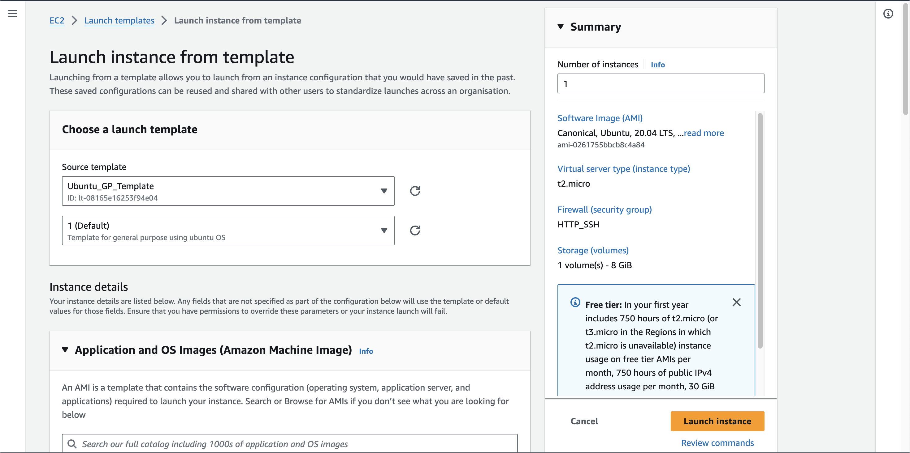

- To choose the operating system and instance type:
  - Ubuntu 20.04
  - t2.micro (free tier)


- To configure network settings:
  - Allow HTTP and SSH connections via the security group.

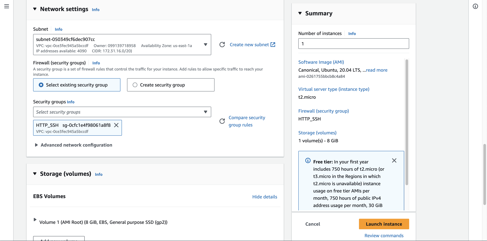

- To configure storage and tags:
  - Use default configuration for storage.
  - Add tags for easier resource management.

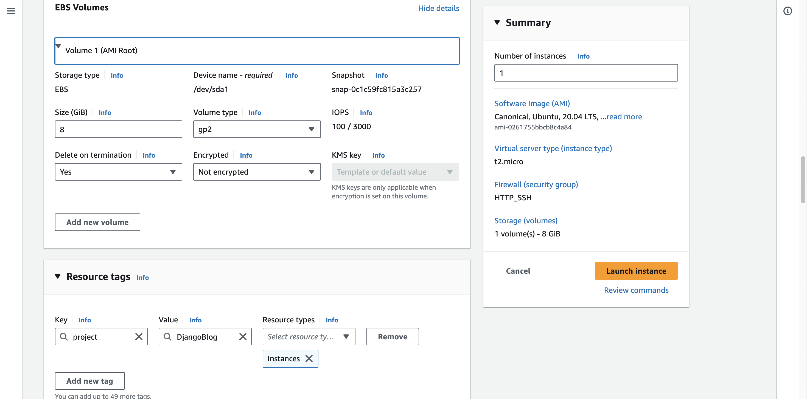

- Instance has been launched:

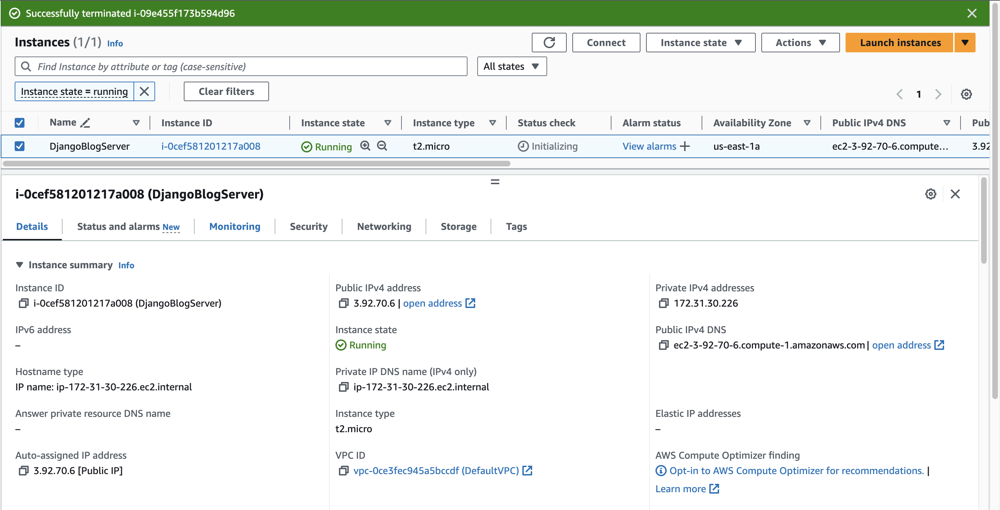

---

## Connect to the EC2 Instance and Load Django Code

- Connect to the EC2 instance using SSH:

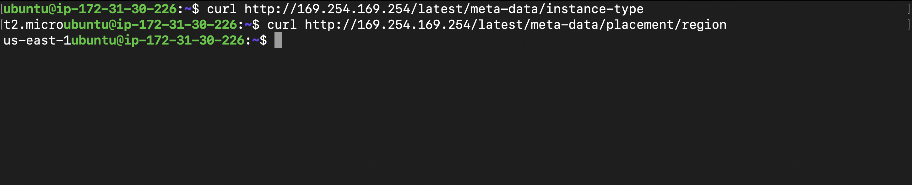

- Update packages to keep the system up-to-date:

```sh
# Update the package list and confirm all actions non-interactively
sudo DEBIAN_FRONTEND=noninteractive apt-get -y update
# Upgrade installed packages to the latest versions non-interactively
sudo DEBIAN_FRONTEND=noninteractive apt-get -y upgrade
```

- Install the `python3-venv` package to manage virtual environments:

```sh
# Install python3-venv package without interactive prompts
sudo DEBIAN_FRONTEND=noninteractive apt-get -y install python3-venv
```

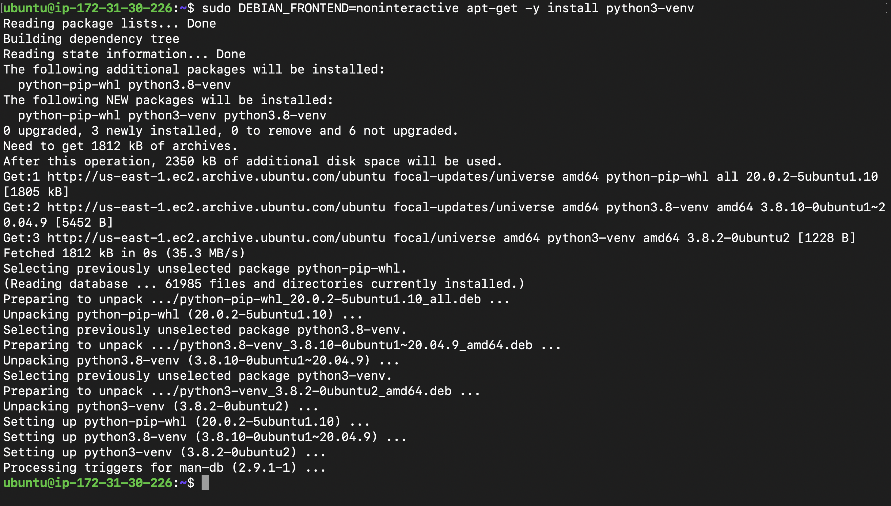

- Establish a virtual environment to isolate the application:

```sh
# Remove any existing virtual environment
rm -rf /home/ubuntu/env
# Create a new Python 3 virtual environment in the specified directory
python3 -m venv /home/ubuntu/env

```

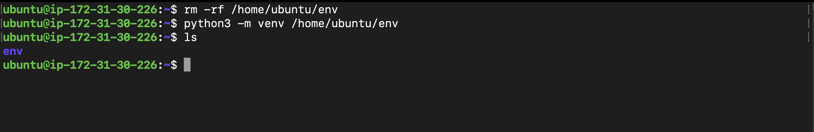

- Download the application code from GitHub:

```sh
# Remove existing project directory and its contents
rm -rf /home/ubuntu/DjangoBlog-Deploy-EC2
# Clone the GitHub repository into the specified directory
git clone https://github.com/simonangel-fong/DjangoBlog-Deploy-EC2.git /home/ubuntu/DjangoBlog-Deploy-EC2

```

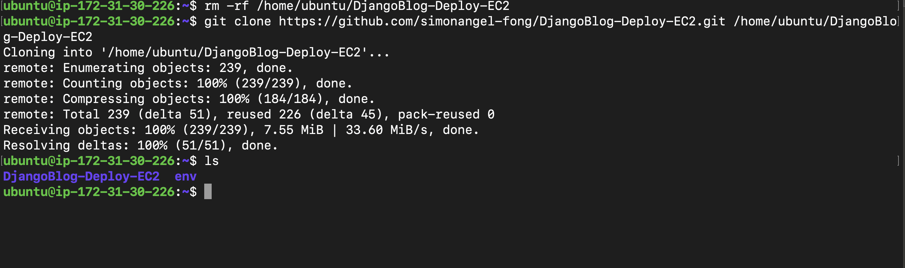

- Install application dependencies:

```sh
# Activate the Python virtual environment
source /home/ubuntu/env/bin/activate

## Install dependencies listed in the requirements.txt file
# pip install -r /home/ubuntu/DjangoBlog-Deploy-EC2/DjangoBlog/requirements.txt

# Install the Django web framework and the django-bootstrap5 package using pip
pip install django django-bootstrap5


# Display installed Python packages and their versions
pip list
```

> Note: The Django 5.0.2 version is not available on pip, so use the pip command instead of the requirements.txt file.

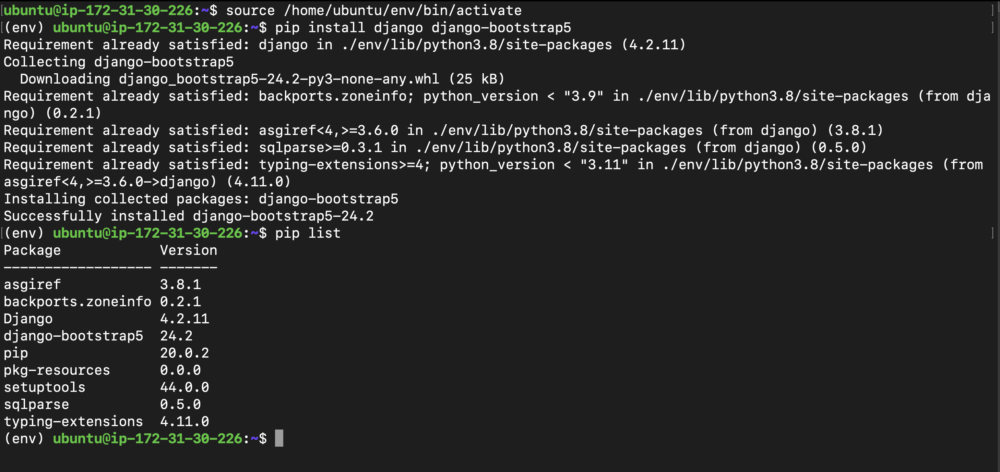

- Migrate the application to create the necessary database schema:

```sh
# Create new migrations based on changes in models
python3 /home/ubuntu/DjangoBlog-Deploy-EC2/DjangoBlog/manage.py makemigrations
# Apply migrations to update the database schema
python3 /home/ubuntu/DjangoBlog-Deploy-EC2/DjangoBlog/manage.py migrate

```

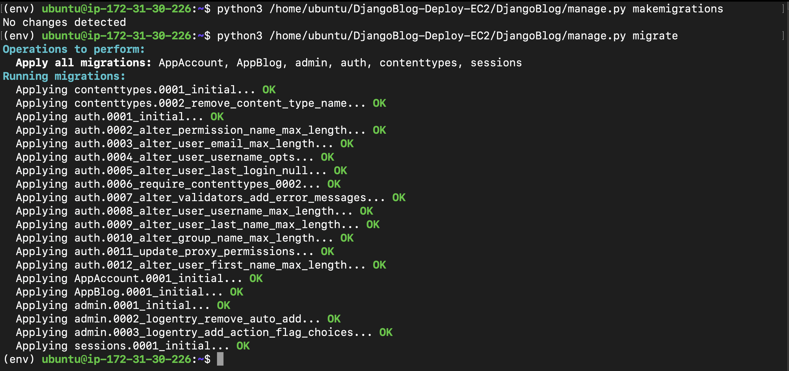

- Collect static files:

```sh
# Collect static files and place them in the specified directory
python3 /home/ubuntu/DjangoBlog-Deploy-EC2/DjangoBlog/manage.py collectstatic

```

- Update ALLOWED_HOSTS in the Django settings file:

```sh
# Add the public IP address to ALLOWED_HOSTS in settings.py
vi /home/ubuntu/DjangoBlog-Deploy-EC2/DjangoBlog/DjangoBlog/settings.py
```

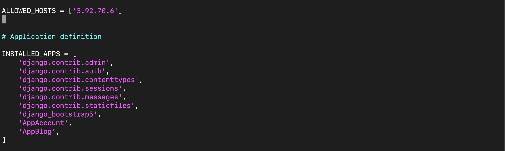

- Create a superuser to access the Django admin interface:

```sh
# Create a superuser for the Django application
python3 /home/ubuntu/DjangoBlog-Deploy-EC2/DjangoBlog/manage.py createsuperuser
```

- Test the application by running the development server on port 8000:

```sh
# Start the Django development server on all network interfaces at port 8000
python3 /home/ubuntu/DjangoBlog-Deploy-EC2/DjangoBlog/manage.py runserver 0.0.0.0:8000
```

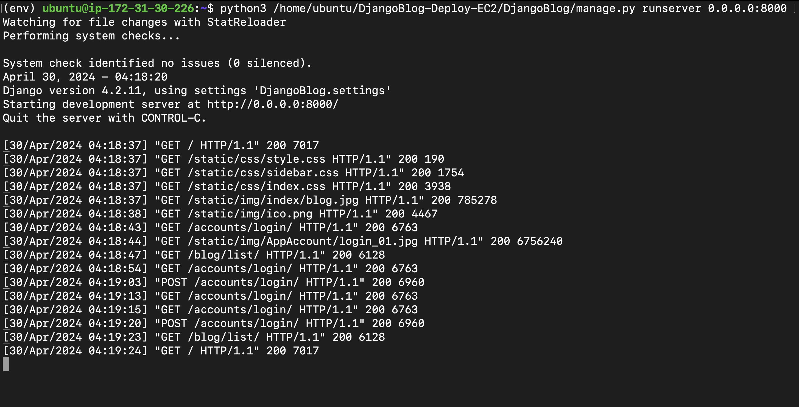

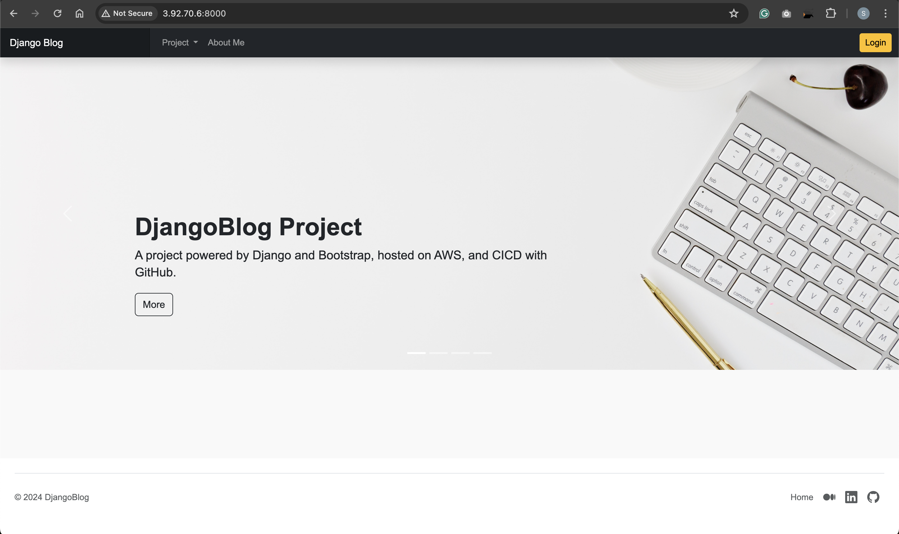

---

## Configure Deployment: Nginx + Gunicorn + Supervisor

To deploy a Django project using `Nginx`, `Gunicorn`, and `Supervisor`:

- `Nginx` acts as a reverse proxy, handling client requests and forwarding them to the application server (`Gunicorn`). It manages SSL termination, caching, and static file serving.
- `Gunicorn` is the WSGI application server that runs the `Django` application and handles incoming requests from `Nginx`.
- `Supervisor` manages the Gunicorn process, ensuring it remains running and restarts it if necessary.

Together, `Nginx` forwards requests to `Gunicorn`, which serves the `Django` application, and `Supervisor` ensures `Gunicorn` is always running for reliable deployment.

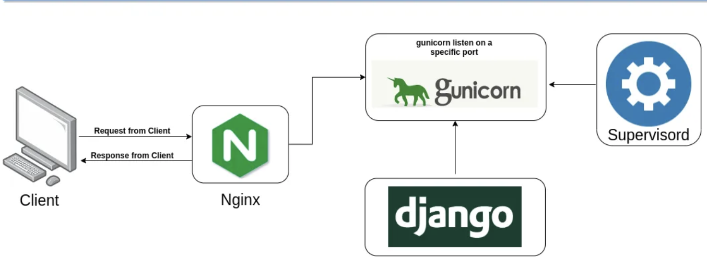

> ref: [How to Install Django Python Framework on CentOS 8](https://medium.com/growininsights/how-to-install-django-python-framework-on-centos-8-5b0ebaad968c)

---

### Install and Configure `Gunicorn`

- Install the `Gunicorn` application server for running Python web applications:

```sh
# Install Gunicorn using pip within the virtual environment
pip install gunicorn

# Deactivate the virtual environment after installation
deactivate
```

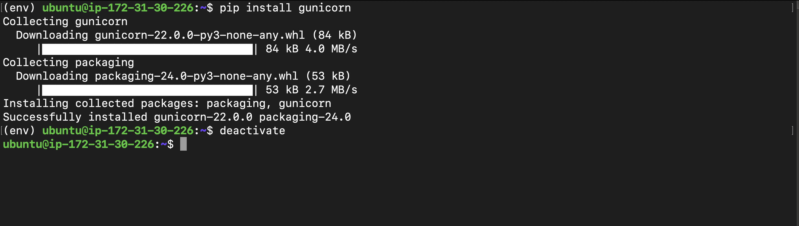

- Configure Gunicorn Socket

Create a Gunicorn socket configuration file:

```sh
# Define the location of the Gunicorn socket configuration file
socket_conf=/etc/systemd/system/gunicorn.socket

# Create and write a Gunicorn socket configuration file at the specified location
sudo bash -c "sudo cat >$socket_conf <<SOCK
[Unit]
Description=gunicorn socket

[Socket]
ListenStream=/run/gunicorn.sock

[Install]
WantedBy=sockets.target
SOCK"

```

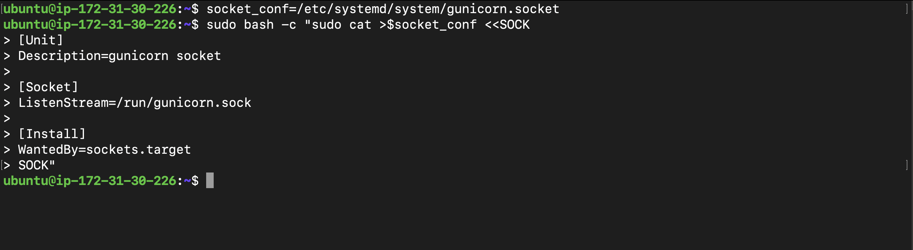

---

- Configure Gunicorn Service
  Create a Gunicorn service configuration file:

```sh
# Define the location of the Gunicorn service configuration file
service_conf=/etc/systemd/system/gunicorn.service

# Create and write a Gunicorn service configuration file at the specified location
sudo bash -c "sudo cat >$service_conf <<SERVICE
[Unit]
Description=gunicorn daemon
Requires=gunicorn.socket
After=network.target

[Service]
User=root
Group=www-data
WorkingDirectory=/home/ubuntu/DjangoBlog-Deploy-EC2/DjangoBlog
ExecStart=/home/ubuntu/env/bin/gunicorn \
    --access-logfile - \
    --workers 3 \
    --bind unix:/run/gunicorn.sock \
    DjangoBlog.wsgi:application

[Install]
WantedBy=multi-user.target
SERVICE"

```

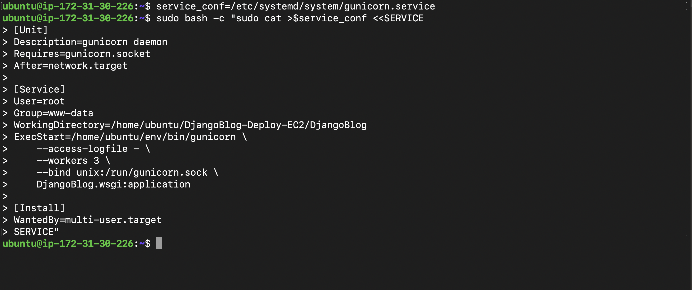

---

- Apply Gunicorn Configuration

```sh
# Start the Gunicorn socket service to listen for incoming connections
sudo systemctl start gunicorn.socket

# Enable the Gunicorn socket service to start automatically at system boot
sudo systemctl enable gunicorn.socket

# Check and display the status of the Gunicorn service, including whether it's running and its current state
sudo systemctl status gunicorn

```

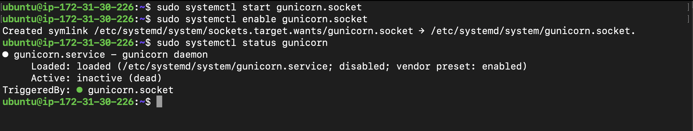

---

- Starts the Gunicorn server for the Django application

Starts the Gunicorn server on all network interfaces (0.0.0.0) at port 8000, running the Django WSGI application DjangoBlog.wsgi:application. This allows the application to accept incoming HTTP requests and serve the Django application.

```sh
# Activate the Python virtual environment located at /home/ubuntu/env
source /home/ubuntu/env/bin/activate

# Change the current working directory to the DjangoBlog project directory
cd /home/ubuntu/DjangoBlog-Deploy-EC2/DjangoBlog

# Start the Gunicorn server, binding it to all network interfaces (0.0.0.0) at port 8000 and specifying the Django WSGI application entry point
gunicorn --bind 0.0.0.0:8000 DjangoBlog.wsgi:application

# Change the current working directory back to the home directory
cd ~

# Deactivate the Python virtual environment
deactivate
```

---

### Install and Configure `Nginx`

- Install the `Nginx` web server:

```sh
# Install Nginx using apt-get and confirm installation without prompts
sudo apt-get install -y nginx

```

---

- Modify the Nginx configuration file:

```sh
# Define the path to the Nginx configuration file
nginx_conf=/etc/nginx/nginx.conf

# Change the user setting in the first line of the configuration file to 'root'
sudo sed -i '1cuser root;' $nginx_conf

```

- Create a Nginx configuration file for the Django project:

```sh
# Define the path for the Django configuration file
django_conf=/etc/nginx/sites-available/django.conf

# Create a Nginx server block configuration file for the Django project at the specified location
sudo bash -c "cat >$django_conf <<DJANGO_CONF
server {
    listen 80;
    # Use OpenDNS resolver to obtain the public IP address and set it as the server_name
    server_name \$(dig +short myip.opendns.com @resolver1.opendns.com);

    # Define how Nginx should handle requests for the favicon
    location = /favicon.ico {
        access_log off;
        log_not_found off;
    }

    # Serve static files from the specified directory
    location /static/ {
        root /home/ubuntu/DjangoBlog-Deploy-EC2/DjangoBlog;
    }

    # Serve media files from the specified directory
    location /media/ {
        root /home/ubuntu/DjangoBlog-Deploy-EC2/DjangoBlog;
    }

    # Proxy all other requests to the Gunicorn socket for the Django application
    location / {
        include proxy_params;
        proxy_pass http://unix:/run/gunicorn.sock;
    }
}
DJANGO_CONF"


```

- Create a link for the Django configuration file in the Nginx sites-enabled directory:

```sh
# Create a link from the Django configuration file in sites-available to sites-enabled
sudo ln -sf /etc/nginx/sites-available/django.conf /etc/nginx/sites-enabled/
```

- Test and restart nginx

```sh
# Test the Nginx configuration for syntax errors
sudo nginx -t

# Restart the Nginx service to apply changes to the configuration
sudo systemctl restart nginx

# Check the status of the Nginx service, including whether it is running and its current state
sudo systemctl status nginx

```

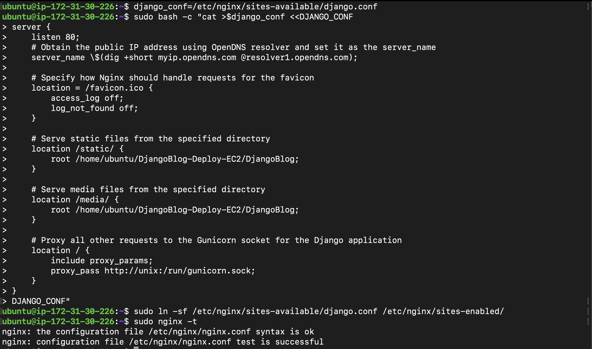

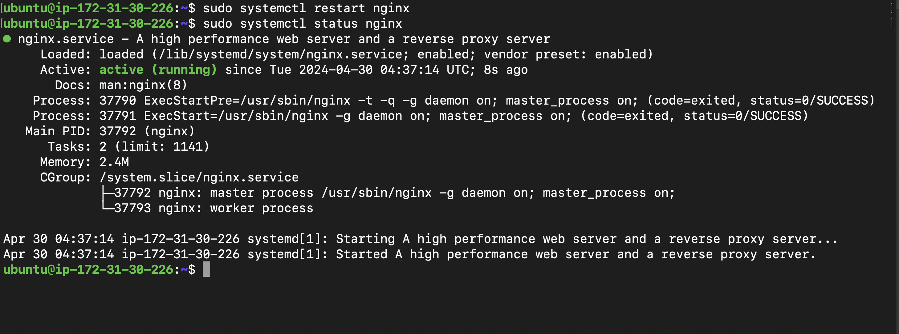

---

### Install and Configure `Supervisor`

- Install `Supervisor` package

```sh
# Install Supervisor using apt-get and confirm installation without prompts
sudo apt-get install -y supervisor

```

- Configure `Supervisor` for managing the Gunicorn process:

```sh
# Create a directory for Gunicorn logging, including necessary parent directories
sudo mkdir -p /var/log/gunicorn

# Define the path for the Supervisor configuration file for Gunicorn
supervisor_gunicorn=/etc/supervisor/conf.d/gunicorn.conf

# Create and write a Supervisor configuration file for Gunicorn at the specified location
sudo bash -c "cat >$supervisor_gunicorn <<SUP_GUN
[program:gunicorn]
    # Set the working directory for the Gunicorn process to the Django project directory
    directory=/home/ubuntu/DjangoBlog-Deploy-EC2/DjangoBlog

    # Define the command to start the Gunicorn server with 3 workers, binding to the UNIX socket
    command=/home/ubuntu/env/bin/gunicorn --workers 3 --bind unix:/run/gunicorn.sock DjangoBlog.wsgi:application

    # Enable autostart and autorestart for automatic startup and restart of the Gunicorn process
    autostart=true
    autorestart=true

    # Specify log file paths for standard error and standard output logs
    stderr_logfile=/var/log/gunicorn/gunicorn.err.log
    stdout_logfile=/var/log/gunicorn/gunicorn.out.log

# Define a group named 'guni' that includes the program 'gunicorn'
[group:guni]
    programs:gunicorn
SUP_GUN"

```

---

- Apply Supervisor configuration changes

```sh
# Instruct Supervisor to reread its configuration file and recognize any new or updated configurations
sudo supervisorctl reread

# Update Supervisor to apply changes found in the configuration file and restart any affected processes
sudo supervisorctl update

```

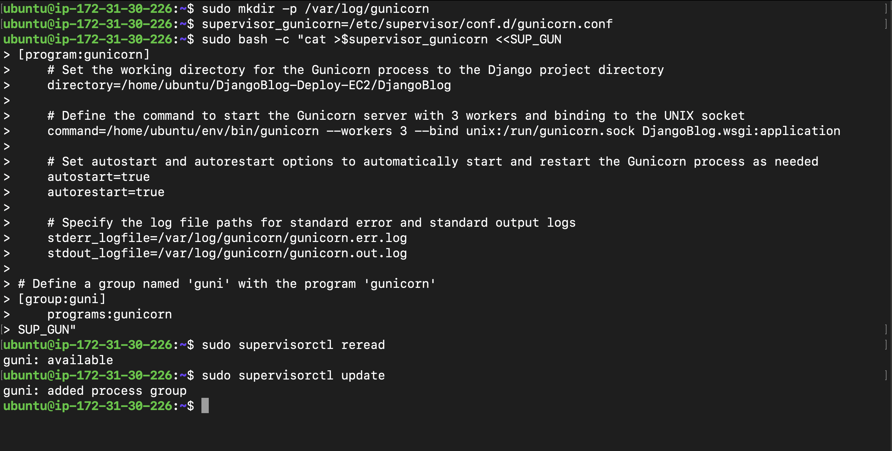

---

### Access the Application Using Public IP

- To access the application, navigate to the public IP address of the EC2 instance in a web browser:

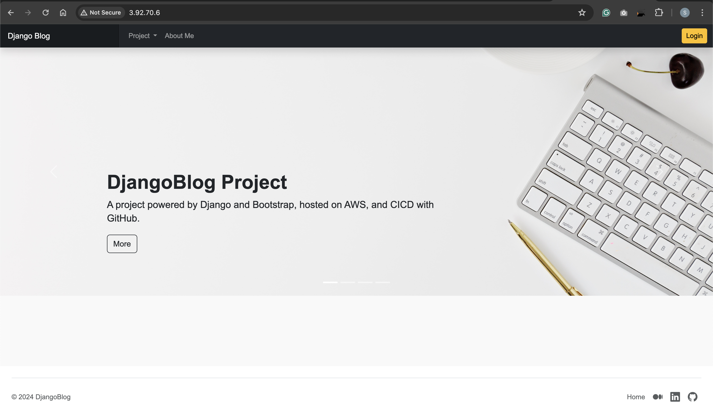


---

## Routing Traffic to an EC2 Using Route53

- Add a domain record to the Nginx configuration file:

```sh
# Edit the Nginx configuration file for the Django project
sudo vi /etc/nginx/sites-available/django.conf

# Test the Nginx configuration for syntax errors and other issues
sudo nginx -t

# Reload the Nginx service to apply changes in configuration without stopping the service
sudo systemctl reload nginx

# Instruct Supervisor to reread its configuration files to recognize any new or updated configurations
sudo supervisorctl reread

# Reload Supervisor to apply the changes from the reread configuration files and restart any affected processes
sudo supervisorctl reload

# Restart the Gunicorn service to apply changes
sudo systemctl restart gunicorn

```

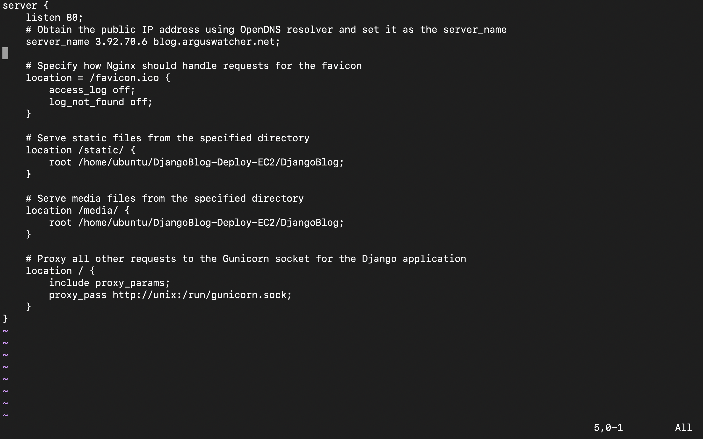

- Add the domain record to the Django settings file:

```sh
# Edit the Django settings file to include the domain record in ALLOWED_HOSTS
vi /home/ubuntu/DjangoBlog-Deploy-EC2/DjangoBlog/DjangoBlog/settings.py

```

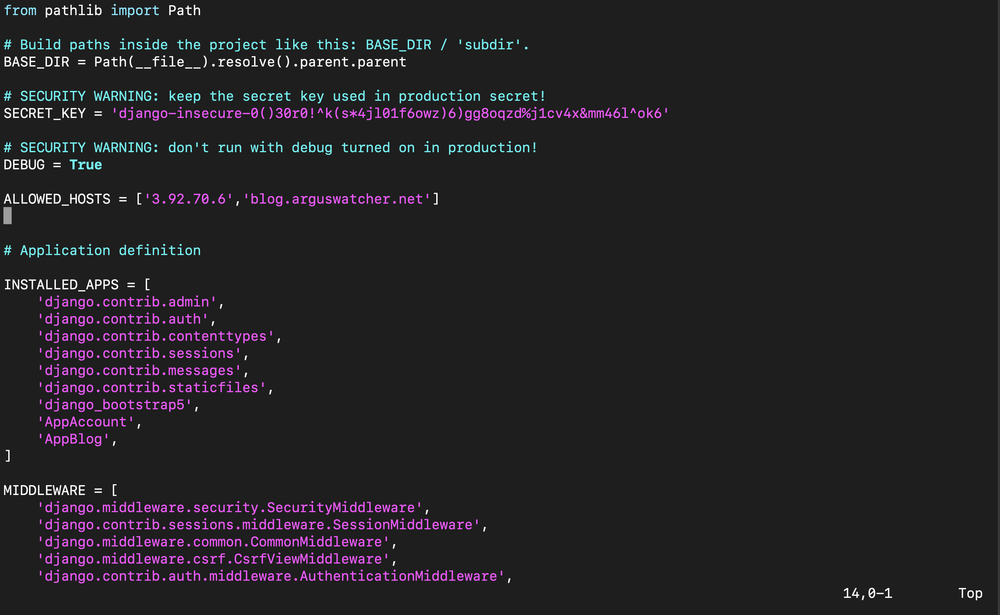

- Create a DNS record in Route53:

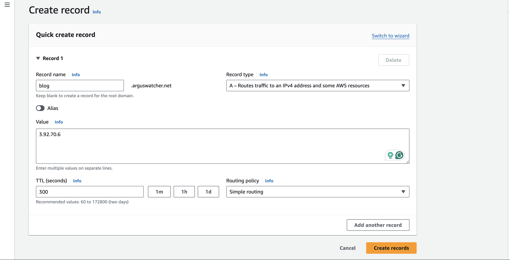

- Test the application:

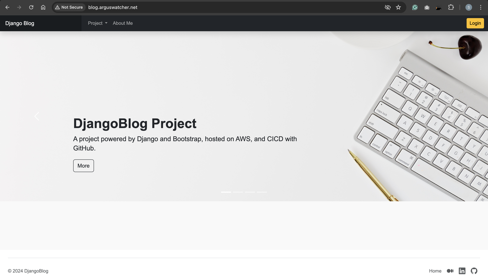

---

## Summary

This document outlines the process of manually deploying a `Django` blog application to an `AWS EC2` instance using the Ubuntu operating system. It includes steps for setting up the EC2 instance, configuring `Gunicorn`, `Nginx`, and `Supervisor`, and routing traffic with `Route53`.

The document details connecting to the EC2 instance, creating a virtual environment, installing dependencies, and configuring the Django application. It also explains how to access the application using the EC2 public IP address and how to route traffic using `Route53`.

---

[TOP](#djangoblog---deploy-on-ec2-manual-aws-ec2-deployment)
