# Document01 - Manual AWS EC2 Deployment

[Back](../../README.md)

- [Document01 - Manual AWS EC2 Deployment](#document01---manual-aws-ec2-deployment)
  - [Create EC2 Instance](#create-ec2-instance)
  - [Configure Deployment](#configure-deployment)
    - [Install and configure gunicorn](#install-and-configure-gunicorn)
    - [Install and configure nginx](#install-and-configure-nginx)
    - [Install and configure supervisor](#install-and-configure-supervisor)
    - [Visit public IP](#visit-public-ip)
  - [Routing traffic to an EC2 using Route53](#routing-traffic-to-an-ec2-using-route53)

---

## Create EC2 Instance

Using template to create EC2 instance

- Template
  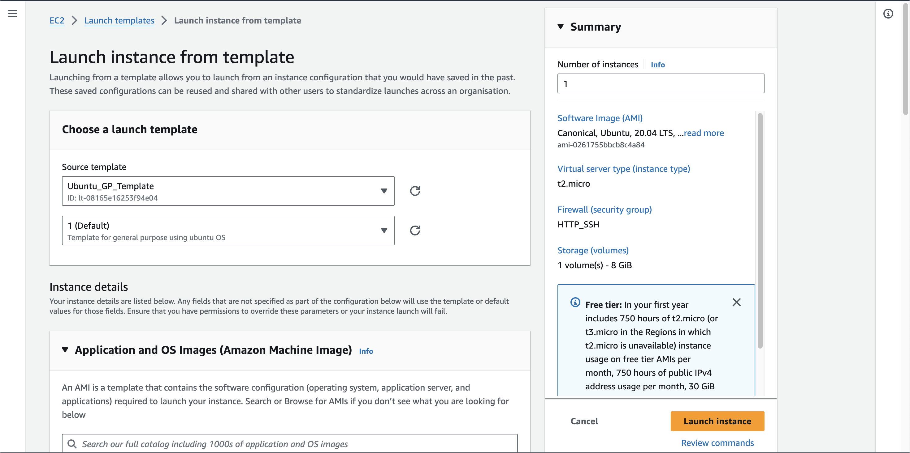

- OS and Instance type
  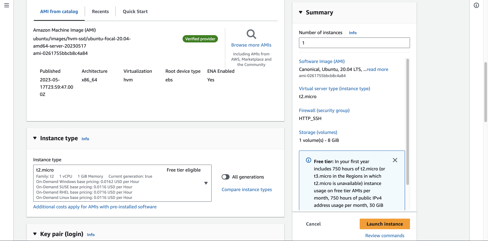

- Network
  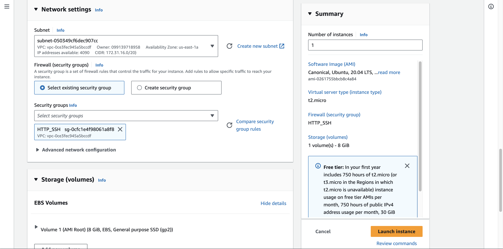

- Storage and Tag
  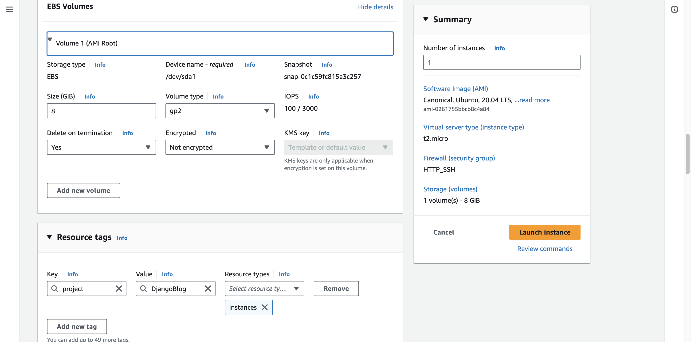

- Launched instance
  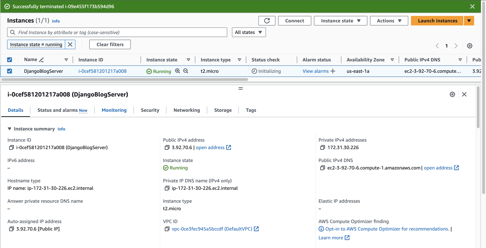

---

## Configure Deployment

- Connect with EC2 instance using SSH

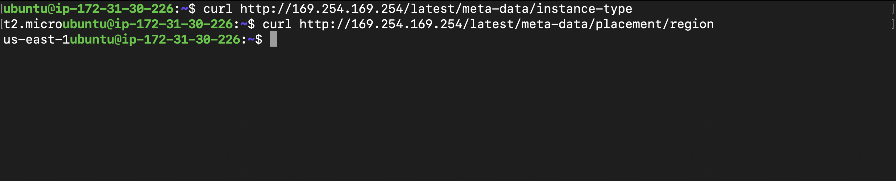

- Update packages

```sh
# Update the package list without interactive prompts and confirm all actions.
sudo DEBIAN_FRONTEND=noninteractive apt-get -y update
# Upgrade installed packages to the latest versions without interactive prompts and confirm all actions.
sudo DEBIAN_FRONTEND=noninteractive apt-get -y upgrade
```

- Install python3-venv package

```sh
sudo DEBIAN_FRONTEND=noninteractive apt-get -y install python3-venv
```

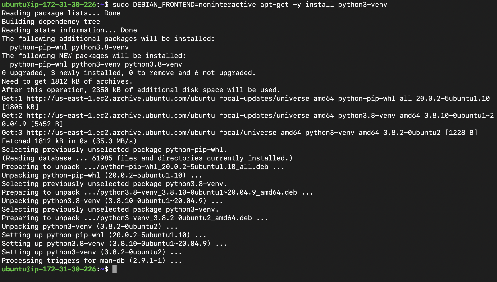

- Establish virtual environment

```sh
# remove existing env
rm -rf /home/ubuntu/env
# Create a Python 3 virtual environment in the directory /home/ubuntu/env
python3 -m venv /home/ubuntu/env
```

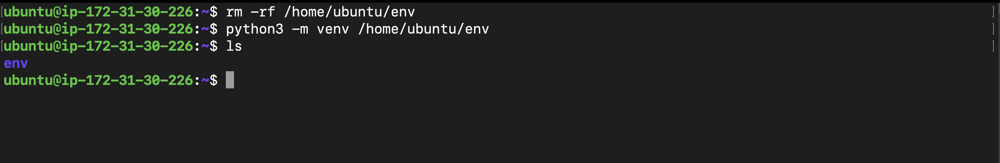

- Download codes from github

```sh
# Remove the existing project directory and all its contents recursively and forcefully
rm -rf /home/ubuntu/DjangoBlog-Deploy-EC2

# Clone the Git repository from the provided URL into the specified directory
git clone https://github.com/simonangel-fong/DjangoBlog-Deploy-EC2.git /home/ubuntu/DjangoBlog-Deploy-EC2
```

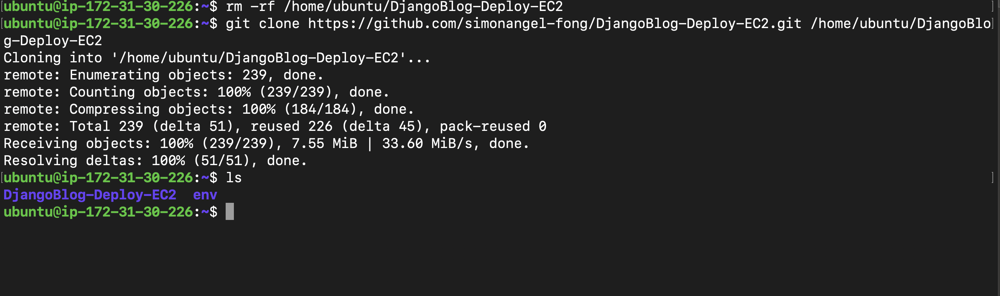

- Install app dependencies

```sh
# Activate the Python virtual environment
source /home/ubuntu/env/bin/activate

# # Install the Python packages listed in the requirements.txt file from the DjangoBlog-Deploy-EC2 project
# pip install -r /home/ubuntu/DjangoBlog-Deploy-EC2/DjangoBlog/requirements.txt

# Install the Django web framework and the django-bootstrap5 package using pip
pip install django django-bootstrap5


# Display the list of installed Python packages and their versions
pip list
```

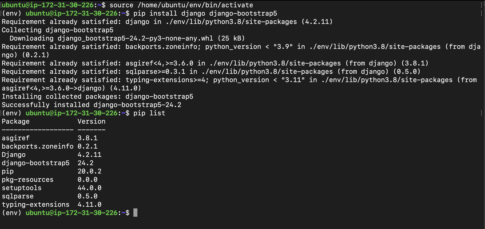

- Migrate App

```sh
# Run the makemigrations command to create new migrations based on changes detected in models for the DjangoBlog project
python3 /home/ubuntu/DjangoBlog-Deploy-EC2/DjangoBlog/manage.py makemigrations

# Apply the migrations to update the database schema according to the latest changes in the DjangoBlog project
python3 /home/ubuntu/DjangoBlog-Deploy-EC2/DjangoBlog/manage.py migrate

```

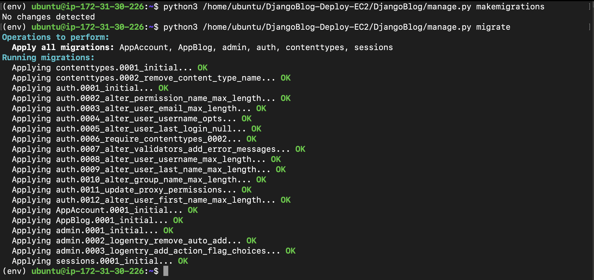

- Collect Static

```sh
# Collect all static files from the DjangoBlog project and place them in the static directory specified in the settings
python3 /home/ubuntu/DjangoBlog-Deploy-EC2/DjangoBlog/manage.py collectstatic

```

- Update allow host

```sh
vi /home/ubuntu/DjangoBlog-Deploy-EC2/DjangoBlog/DjangoBlog/settings.py
# add public IP in ALLOWED_HOSTS
```

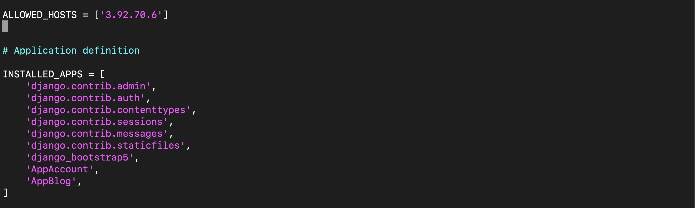

- Create a user

```sh
python3 /home/ubuntu/DjangoBlog-Deploy-EC2/DjangoBlog/manage.py createsuperuser
```

- Test on EC2 with port 8000

```sh
# Start the Django development server for the DjangoBlog project on all network interfaces (0.0.0.0) at port 8000
python3 /home/ubuntu/DjangoBlog-Deploy-EC2/DjangoBlog/manage.py runserver 0.0.0.0:8000
```

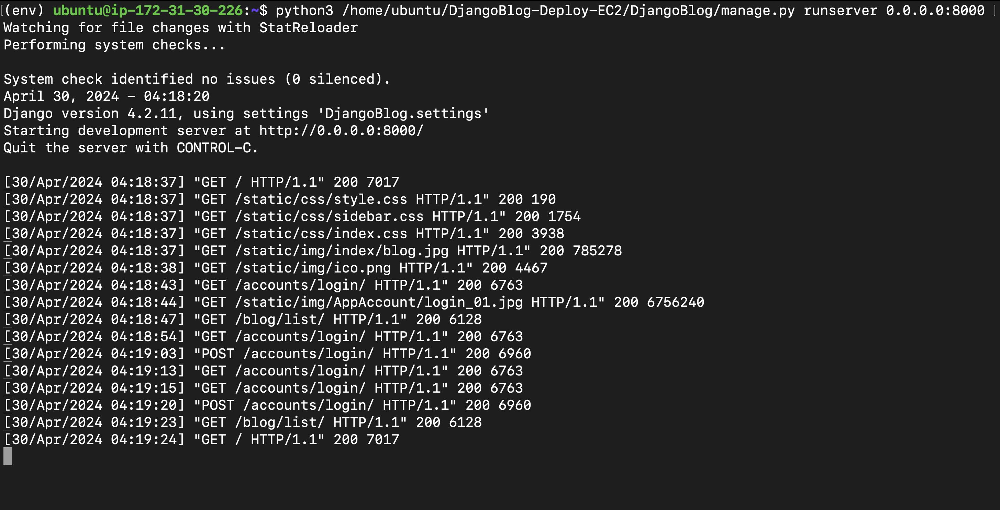

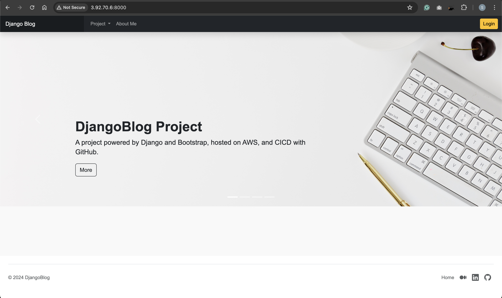

---

### Install and configure gunicorn

- Install gunicorn in venv

```sh
# Install the Gunicorn application server for running Python web applications using pip
pip install gunicorn

# Deactivate the currently active Python virtual environment
deactivate
```

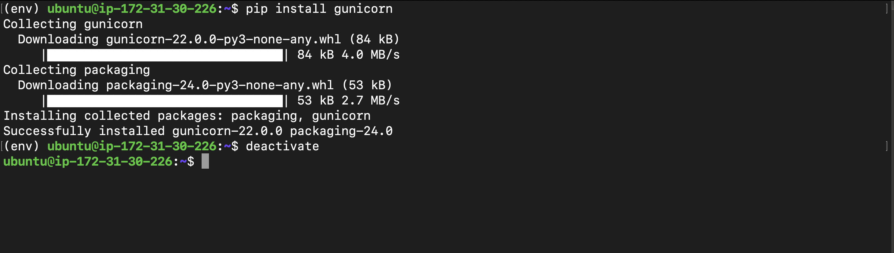

- Configuration gunicorn.socket

```sh
# Define the location of the Gunicorn socket configuration file
socket_conf=/etc/systemd/system/gunicorn.socket

# Create and write a Gunicorn socket configuration file at the specified location
sudo bash -c "sudo cat >$socket_conf <<SOCK
[Unit]
Description=gunicorn socket

[Socket]
ListenStream=/run/gunicorn.sock

[Install]
WantedBy=sockets.target
SOCK"

```

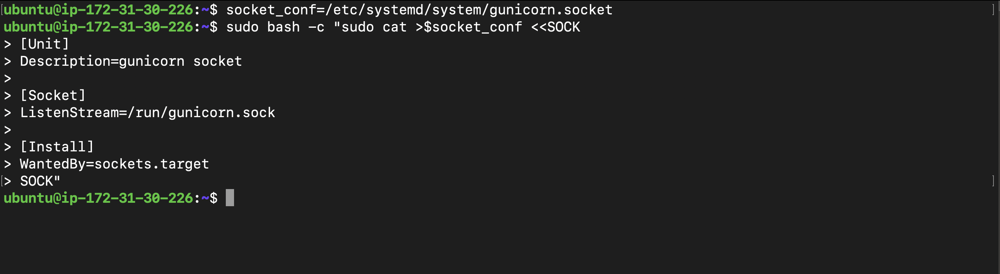

---

- Configuration gunicorn.service

```sh
# Define the location of the Gunicorn service configuration file
service_conf=/etc/systemd/system/gunicorn.service

# Create and write a Gunicorn service configuration file at the specified location
sudo bash -c "sudo cat >$service_conf <<SERVICE
[Unit]
Description=gunicorn daemon
Requires=gunicorn.socket
After=network.target

[Service]
User=root
Group=www-data
WorkingDirectory=/home/ubuntu/DjangoBlog-Deploy-EC2/DjangoBlog
ExecStart=/home/ubuntu/env/bin/gunicorn \
    --access-logfile - \
    --workers 3 \
    --bind unix:/run/gunicorn.sock \
    DjangoBlog.wsgi:application

[Install]
WantedBy=multi-user.target
SERVICE"

```

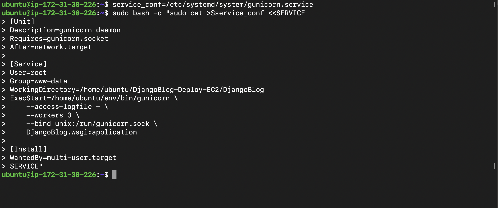

---

- Apply gunicorn configuration

```sh
# Start the Gunicorn socket service to listen for incoming connections
sudo systemctl start gunicorn.socket

# Enable the Gunicorn socket service to start automatically at system boot
sudo systemctl enable gunicorn.socket

# Check and display the status of the Gunicorn service, including whether it's running and its current state
sudo systemctl status gunicorn

```

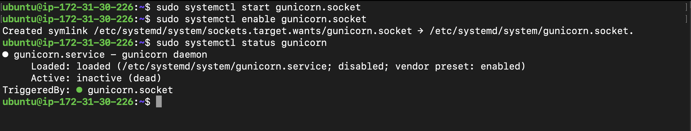

---

- Visit port 8000 to test

```sh
# Activate the Python virtual environment located at /home/ubuntu/env
source /home/ubuntu/env/bin/activate

# Change the current working directory to the DjangoBlog project directory
cd /home/ubuntu/DjangoBlog-Deploy-EC2/DjangoBlog

# Start the Gunicorn server, binding it to all network interfaces (0.0.0.0) at port 8000 and specifying the Django WSGI application entry point
gunicorn --bind 0.0.0.0:8000 DjangoBlog.wsgi:application

# Change the current working directory back to the home directory
cd ~

# Deactivate the Python virtual environment
deactivate
```

---

### Install and configure nginx

- Install nginx

```sh
# Install the Nginx web server using apt-get, answering "yes" to any prompts
sudo apt-get install -y nginx

```

---

- modify nginx conf

```sh
# Modify the first line of the Nginx configuration file to set the user to 'root'
nginx_conf=/etc/nginx/nginx.conf
sudo sed -i '1cuser root;' $nginx_conf
```

- create django.conf file

```sh
# Define the location of the Nginx configuration file for the Django project
django_conf=/etc/nginx/sites-available/django.conf

# Create and write a Nginx server block configuration for the Django project at the specified location
sudo bash -c "cat >$django_conf <<DJANGO_CONF
server {
    listen 80;
    # Obtain the public IP address using OpenDNS resolver and set it as the server_name
    server_name \$(dig +short myip.opendns.com @resolver1.opendns.com);

    # Specify how Nginx should handle requests for the favicon
    location = /favicon.ico {
        access_log off;
        log_not_found off;
    }

    # Serve static files from the specified directory
    location /static/ {
        root /home/ubuntu/DjangoBlog-Deploy-EC2/DjangoBlog;
    }

    # Serve media files from the specified directory
    location /media/ {
        root /home/ubuntu/DjangoBlog-Deploy-EC2/DjangoBlog;
    }

    # Proxy all other requests to the Gunicorn socket for the Django application
    location / {
        include proxy_params;
        proxy_pass http://unix:/run/gunicorn.sock;
    }
}
DJANGO_CONF"


```

- Creat link in sites-enabled directory

```sh
# Create a symbolic link from the Django configuration file in sites-available to sites-enabled, replacing any existing link
sudo ln -sf /etc/nginx/sites-available/django.conf /etc/nginx/sites-enabled/

```

- Test and restart nginx

```sh
# Test the Nginx configuration for syntax errors and other issues
sudo nginx -t

# Restart the Nginx service to apply configuration changes
sudo systemctl restart nginx

# Check and display the status of the Nginx service, including whether it's running and its current state
sudo systemctl status nginx

```

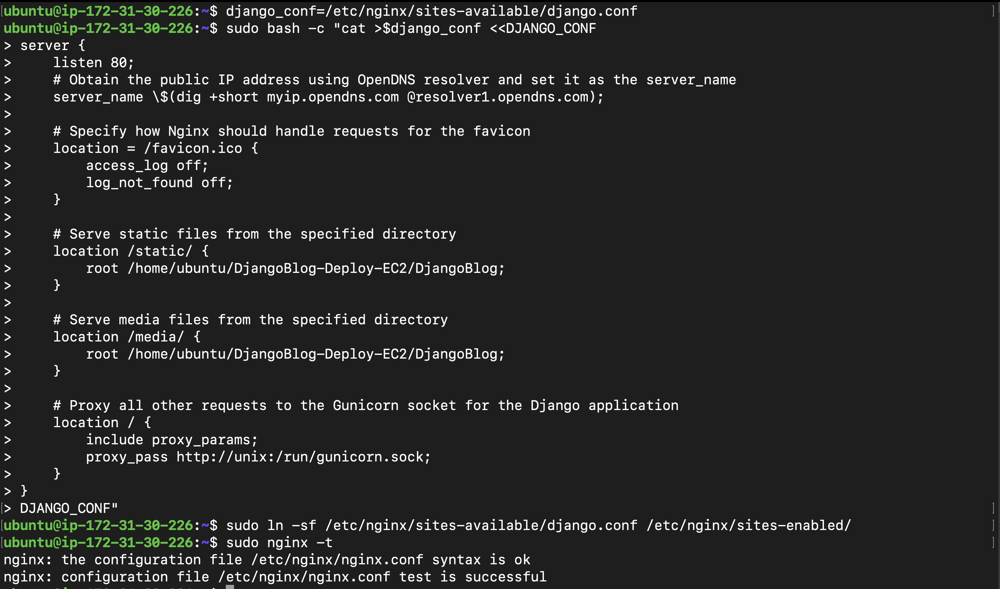

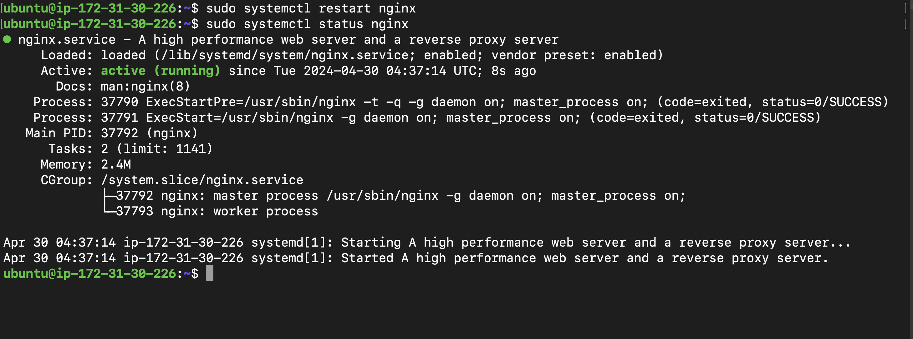

---

### Install and configure supervisor

- Install supervisor

```sh
# Install the Supervisor process control system using apt-get, answering "yes" to any prompts
sudo apt-get install -y supervisor

```

- Configuration supervisor

```sh
# Create the directory for Gunicorn logging, including any necessary parent directories
sudo mkdir -p /var/log/gunicorn

# Define the path for the Supervisor configuration file for Gunicorn
supervisor_gunicorn=/etc/supervisor/conf.d/gunicorn.conf

# Create and write a Supervisor configuration file for Gunicorn at the specified location
sudo bash -c "cat >$supervisor_gunicorn <<SUP_GUN
[program:gunicorn]
    # Set the working directory for the Gunicorn process to the Django project directory
    directory=/home/ubuntu/DjangoBlog-Deploy-EC2/DjangoBlog

    # Define the command to start the Gunicorn server with 3 workers and binding to the UNIX socket
    command=/home/ubuntu/env/bin/gunicorn --workers 3 --bind unix:/run/gunicorn.sock DjangoBlog.wsgi:application

    # Set autostart and autorestart options to automatically start and restart the Gunicorn process as needed
    autostart=true
    autorestart=true

    # Specify the log file paths for standard error and standard output logs
    stderr_logfile=/var/log/gunicorn/gunicorn.err.log
    stdout_logfile=/var/log/gunicorn/gunicorn.out.log

# Define a group named 'guni' with the program 'gunicorn'
[group:guni]
    programs:gunicorn
SUP_GUN"

```

---

- update supervisor

```sh
# Tell Supervisor to reread its configuration file and recognize any new or updated configurations
sudo supervisorctl reread

# Update Supervisor to apply any changes found in the configuration file and restart any processes as necessary
sudo supervisorctl update

```

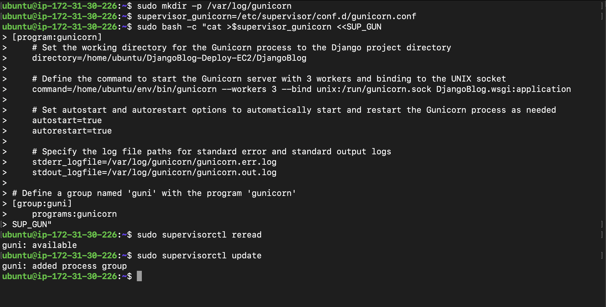

---

### Visit public IP

- Visit App with public IP

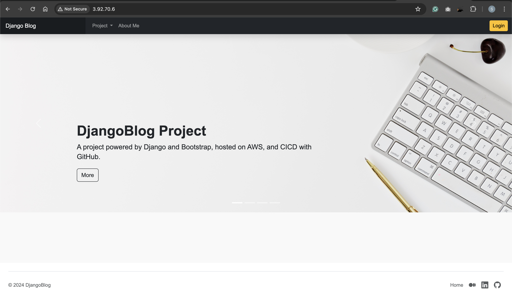


---

## Routing traffic to an EC2 using Route53

- Add Domain record to Nginx

```sh
sudo vi /etc/nginx/sites-available/django.conf

# Test the Nginx configuration for syntax errors and other issues
sudo nginx -t

# Reload the Nginx service to apply changes in configuration without stopping the service
sudo systemctl reload nginx

# Instruct Supervisor to reread its configuration files and recognize any new or updated configurations
sudo supervisorctl reread

# Reload Supervisor to apply the changes found in the reread configuration files and restart any affected processes
sudo supervisorctl reload


# Restart the Gunicorn service
sudo systemctl restart gunicorn

```

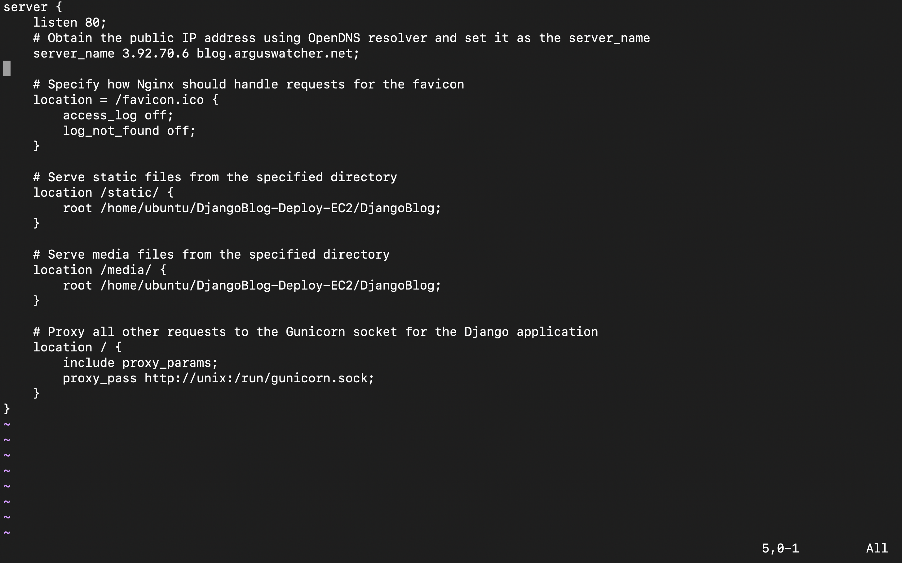

- Add Domain record to ALLOWED_HOSTS

```sh
vi /home/ubuntu/DjangoBlog-Deploy-EC2/DjangoBlog/DjangoBlog/settings.py
```

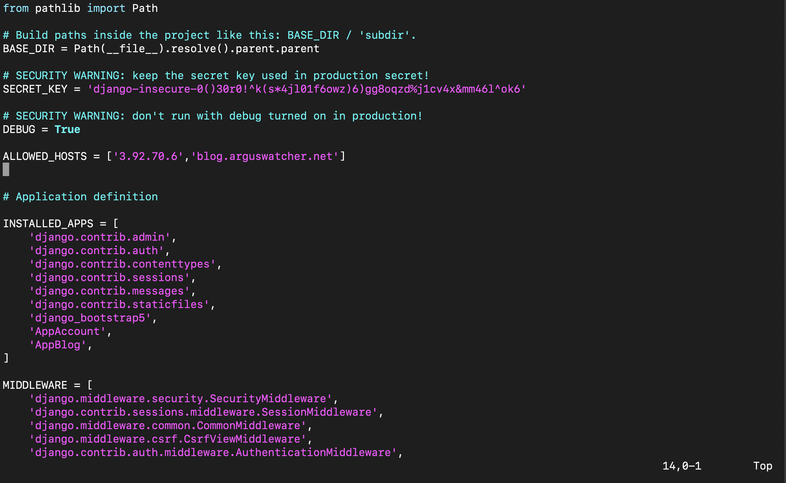

- Create DNS record

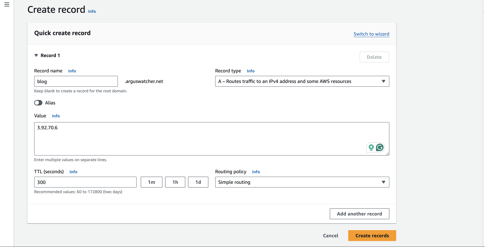

- Test

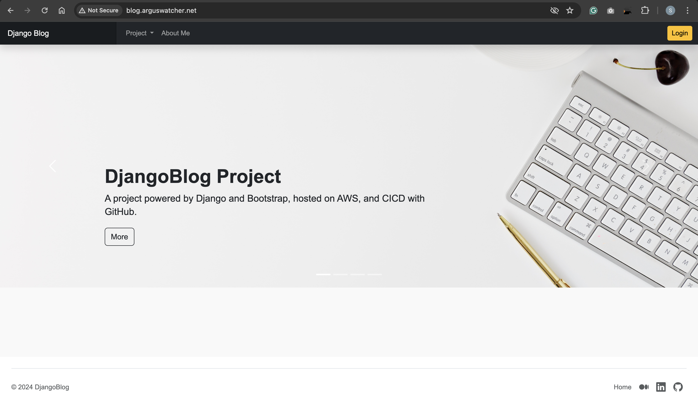

---

[TOP](#manual-aws-ec2-deployment)
