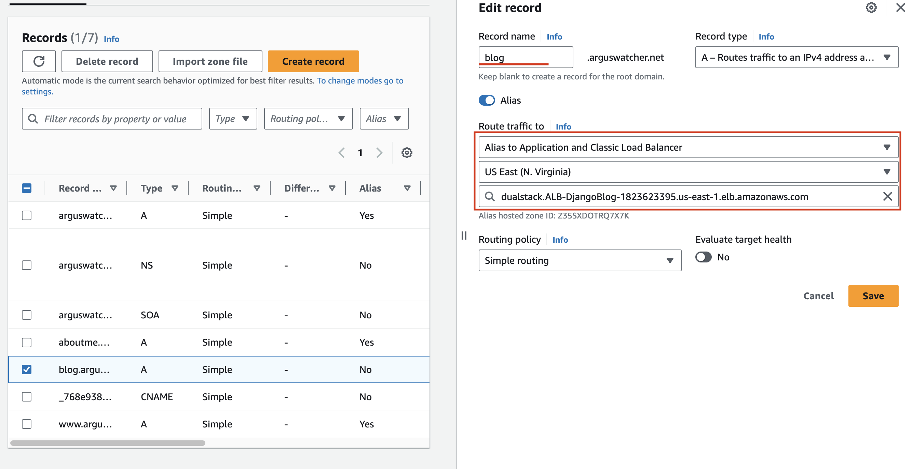

# Document01 - Enable HTTPS

[Back](../../README.md)

- [Document01 - Enable HTTPS](#document01---enable-https)
  - [Enable HTTPS using ACM](#enable-https-using-acm)
  - [Debug CSRF verification failed](#debug-csrf-verification-failed)
  - [Test HTTPS](#test-https)

---

## Enable HTTPS using ACM

- Create a certificate in ACM


- Create target group


- Create Application load balancer


Add 2 listeners


Select certificate from ACM


- Update DNS record in Route53



---

## Debug CSRF verification failed

- Add parameter into settings.py

```py
CSRF_TRUSTED_ORIGINS = ["http://*.arguswatcher.net", "https://*.arguswatcher.net"]
```


## Test HTTPS

So far, the DjangoBlog application is deployed on EC2 with HTTPS protocol.


---

[Top](#document01---enable-https)
