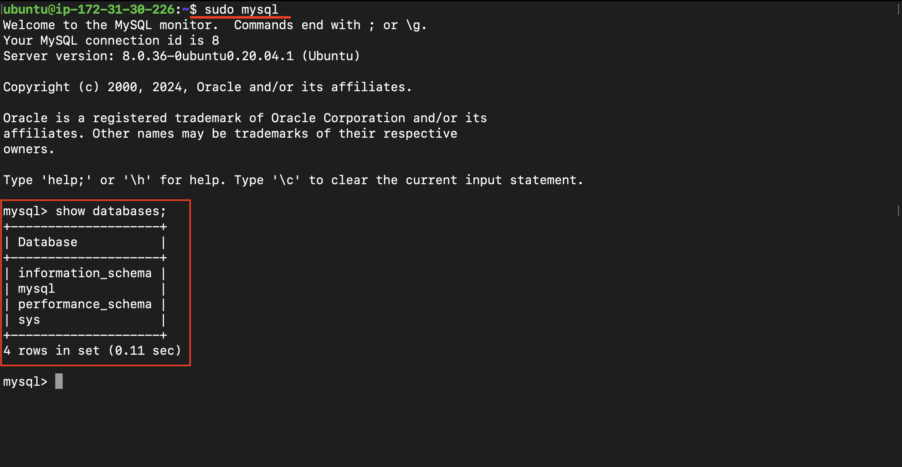
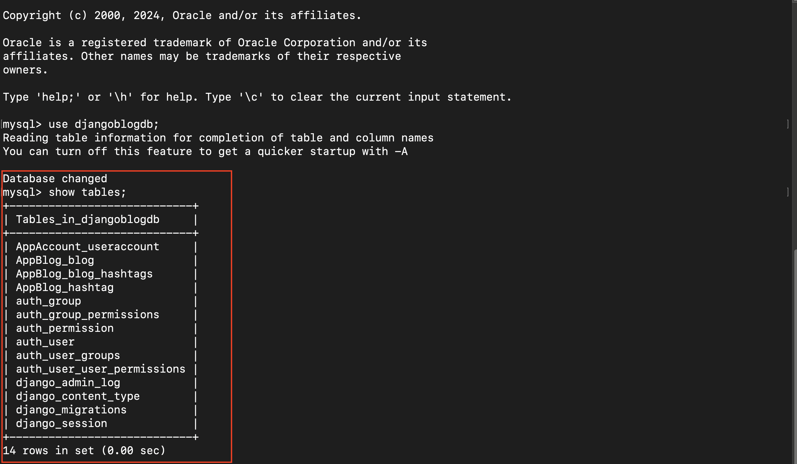
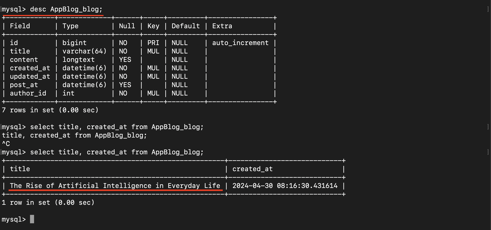

# Connect with MYSQL within EC2

[Back](../../README.md)

- [Connect with MYSQL within EC2](#connect-with-mysql-within-ec2)
  - [Install MySQL](#install-mysql)
  - [Configure Django Settings](#configure-django-settings)
  - [Migrate](#migrate)
  - [Test](#test)

---

## Install MySQL

```sh
sudo apt install -y mysql-server
```

- Check the status of MySql

```sh
sudo systemctl status mysql
```


Next, you need to install the MySQL client and the MySQL adapter for Python:

```sh
sudo apt install -y mysql-client
sudo apt-get install -y python3-dev default-libmysqlclient-dev build-essential pkg-config

source /home/ubuntu/env/bin/activate
pip install mysqlclient
```

- login to MySQL as a root
- Change the pwd of root

```sh
sudo mysql -u root -p
```




```sql
# sudo mysql
ALTER USER 'root'@'localhost' IDENTIFIED BY 'new_password';
```

---

- create a new database for your Django project:

```sql
CREATE DATABASE djangoblogdb;
```

---

create a new user and grant the user permissions to the database:

```sql
CREATE USER 'blog_admin'@'localhost' IDENTIFIED BY 'password';
GRANT ALL PRIVILEGES ON djangoblogdb.* TO 'blog_admin'@'localhost';
FLUSH PRIVILEGES;
```

---

## Configure Django Settings

In your Django project, open the settings.py file. Find the DATABASES configuration section and modify it to connect to your MySQL database:

```python
DATABASES = {
    'default': {
        'ENGINE': 'django.db.backends.mysql',
        'NAME': 'djangoblogdb',
        'USER': 'blog_admin',
        'PASSWORD': 'password',
        'HOST': 'localhost',
        'PORT': '3306',
    }
}
```

- reload gunicorn
- reload supervisor

## Migrate

```sh
python3 DjangoBlog-Deploy-EC2/DjangoBlog/manage.py makemigrations
python3 DjangoBlog-Deploy-EC2/DjangoBlog/manage.py migrate
```




---

## Test

- Create a blog on the page


- Confirm the blog in the MySql



---

[TOP](#connect-with-mysql-within-ec2)
