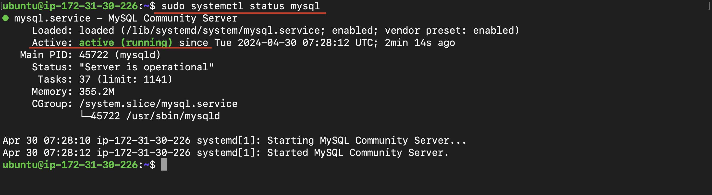
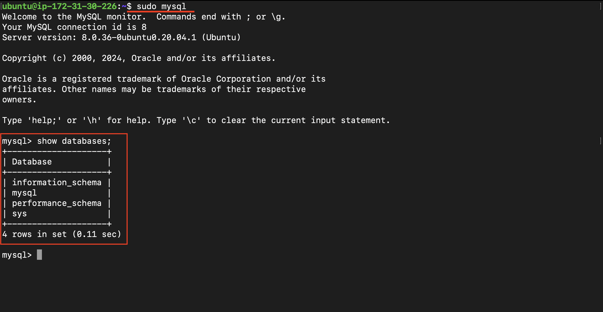
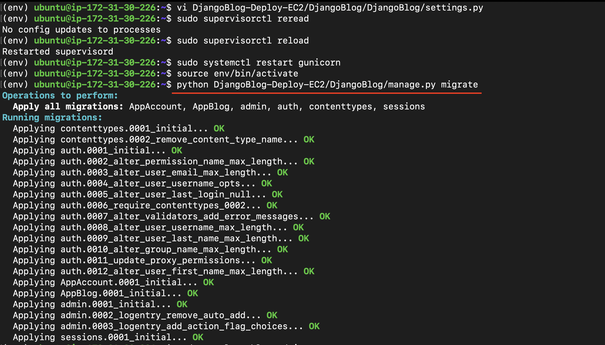
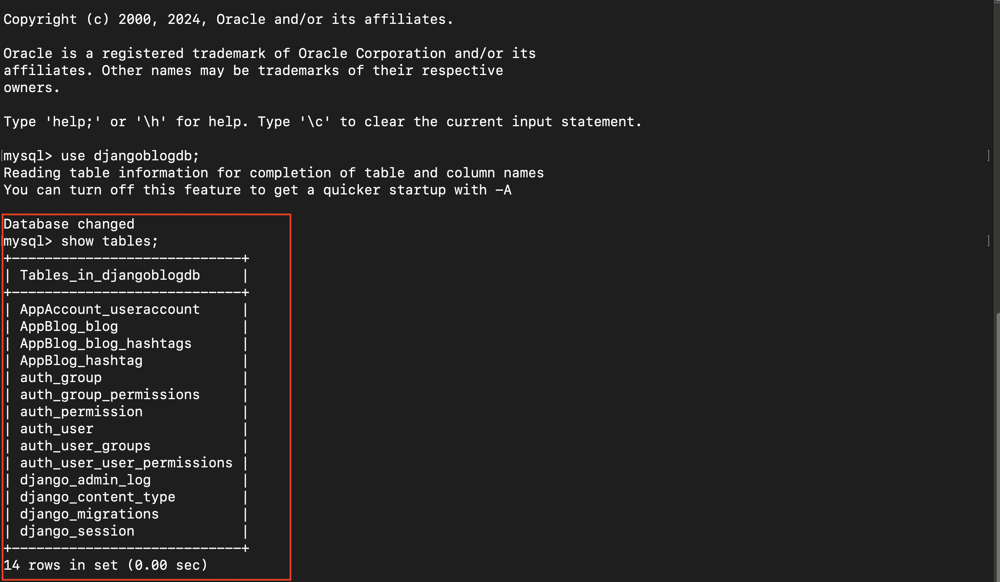
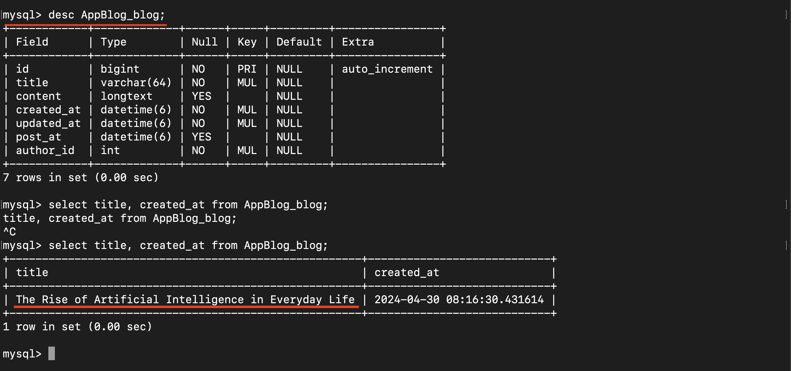

# DjangoBlog - Deploy on EC2: Connect with MYSQL

[Back](../../README.md)

- [DjangoBlog - Deploy on EC2: Connect with MYSQL](#djangoblog---deploy-on-ec2-connect-with-mysql)
  - [Introduction](#introduction)
  - [Installing MySQL](#installing-mysql)
  - [Create Database and User](#create-database-and-user)
  - [Configure Django Settings](#configure-django-settings)
  - [Migrate](#migrate)
  - [Test](#test)

---

## Introduction

This document outlines the process of installing and configuring `MySQL` for the `DjangoBlog` project on an EC2 instance. It covers installing `MySQL` server and client, setting up a new database and user for the project, and configuring `Django` settings to connect to the `MySQL` database. Additionally, it includes instructions for performing migrations and testing the database setup within the application. This process ensures that the Django project is properly integrated with `MySQL`, providing a solid foundation for data management and application functionality.

---

## Installing MySQL

- Installs `MySQL server` package to enable database management for the application.

```sh
# Install MySQL Server package
sudo apt install -y mysql-server
```

- Verifies that MySQL server is running properly.

```sh
# Check MySQL Status
sudo systemctl status mysql
```



- Install `MySQL Client` and `Python Adapter`:

Installs the MySQL client and necessary packages for connecting Python applications to MySQL databases.

```sh
# Installs MySQL client
sudo apt install -y mysql-client

# Installs dependencies for the Python MySQL adapter
sudo apt-get install -y python3-dev default-libmysqlclient-dev build-essential pkg-config

# Activates Python virtual environment
source /home/ubuntu/env/bin/activate
# Installs MySQL adapter for Python
pip install mysqlclient
```

---

## Create Database and User

- Log in to MySQL as Root and Change Root Password

```sh
# Logs into MySQL as the root user and changes the root password.
sudo mysql -u root -p
```



```sql
# Changes the root user's password
ALTER USER 'root'@'localhost' IDENTIFIED BY 'new_password';
```

- Create a New Database for Django Project:

```sql
-- Establishes a new database for the Django project.
CREATE DATABASE djangoblogdb;
```

- Create a New User and Grant Database Permissions:

```sql
-- Creates a new user for the Django project and grants permissions to the new database.
CREATE USER 'blog_admin'@'localhost' IDENTIFIED BY 'password';
GRANT ALL PRIVILEGES ON djangoblogdb.* TO 'blog_admin'@'localhost';
FLUSH PRIVILEGES;
```

---

## Configure Django Settings

To connect `Django` to the `MySQL` database, update the `settings.py` file in the Django project. Locate the `DATABASES` configuration section and modify it as follows:

```python
DATABASES = {
    'default': {
        'ENGINE': 'django.db.backends.mysql',  # Specifies MySQL as the database backend
        'NAME': 'djangoblogdb',  # Name of the MySQL database
        'USER': 'blog_admin',  # MySQL user for the application
        'PASSWORD': 'password',  # Password for the MySQL user
        'HOST': 'localhost',  # Host where the MySQL server is running
        'PORT': '3306',  # MySQL server port number
    }
}

```

After updating the settings, reload Gunicorn and Supervisor to apply the changes and ensure that the application runs with the new database configuration.

```sh
# Reload Gunicorn
sudo systemctl reload gunicorn

# Reload Supervisor
sudo supervisorctl reload

```

---

## Migrate

After updating `Django` settings, perform migrations to apply changes to the `MySQL` database.

```sh
# Creates migration files based on changes in models.
python3 DjangoBlog-Deploy-EC2/DjangoBlog/manage.py makemigrations

# Applies migrations to update the MySQL database schema.
python3 DjangoBlog-Deploy-EC2/DjangoBlog/manage.py migrate
```





---

## Test

After setting up the `MySQL` database and connecting it to `Django`, perform the following tests to confirm that the application is functioning as expected:

- Create a Blog:

Use the application interface to create a new blog post.


- Confirm the Blog in `MySQL`:

Verify that the new blog post has been successfully saved to the `MySQL` database by checking the database directly.



---

[TOP](#djangoblog---deploy-on-ec2-connect-with-mysql)
