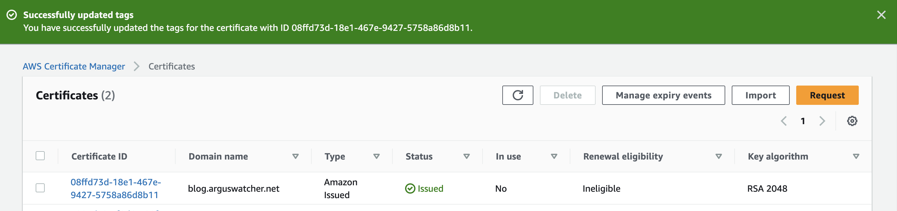
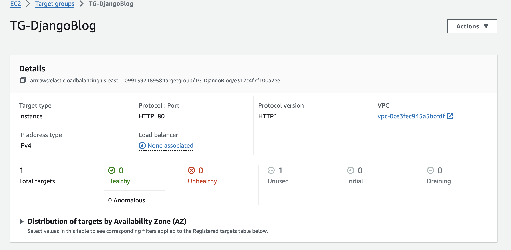
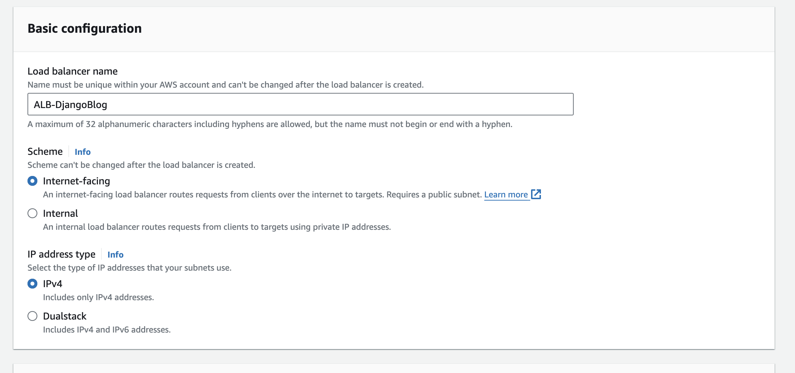
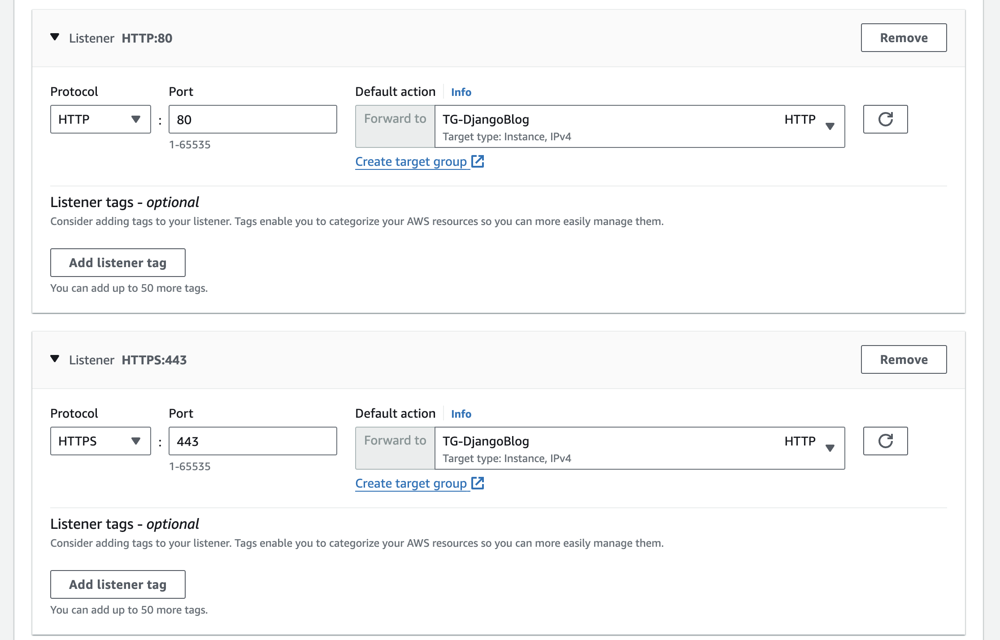
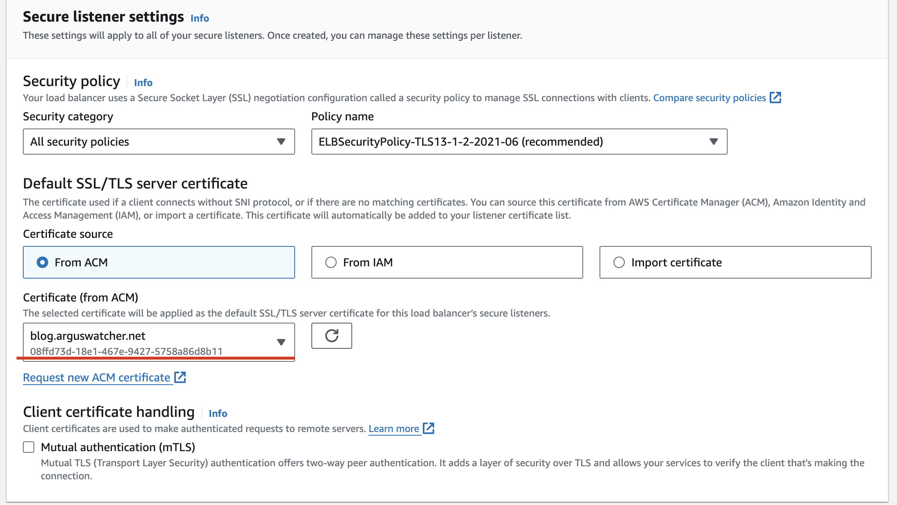
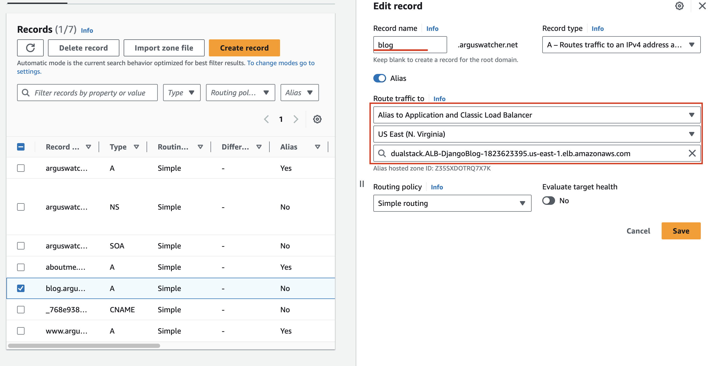
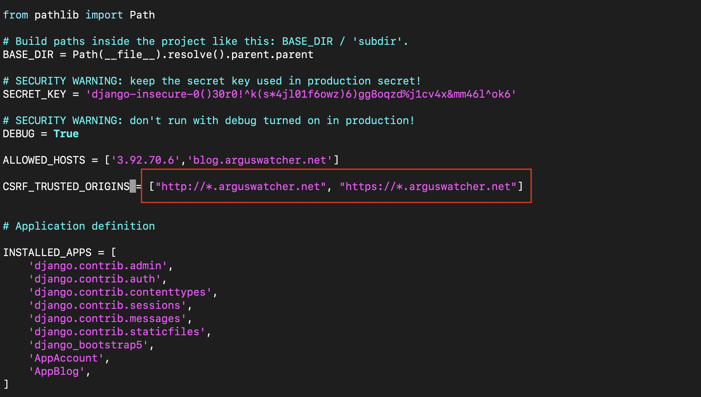
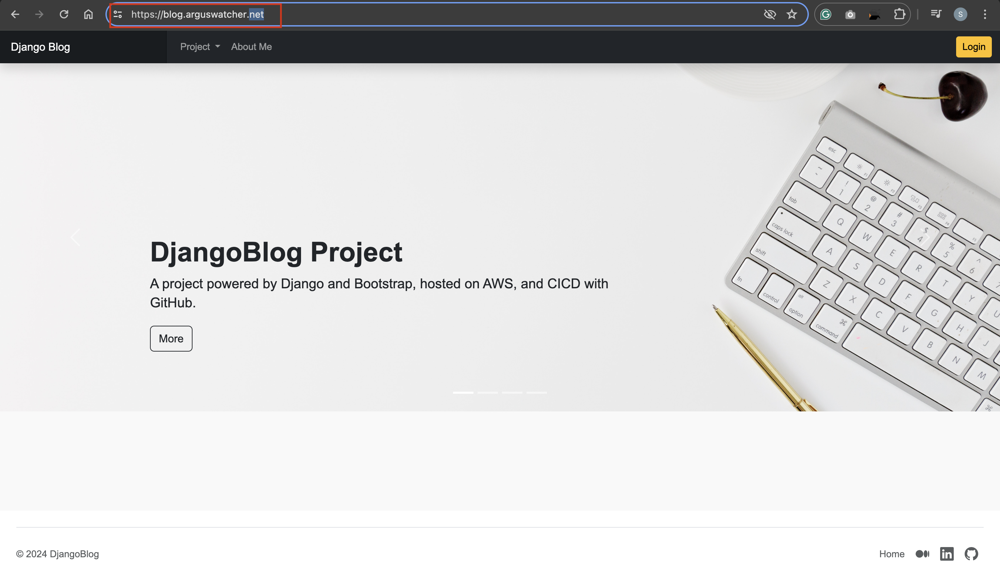
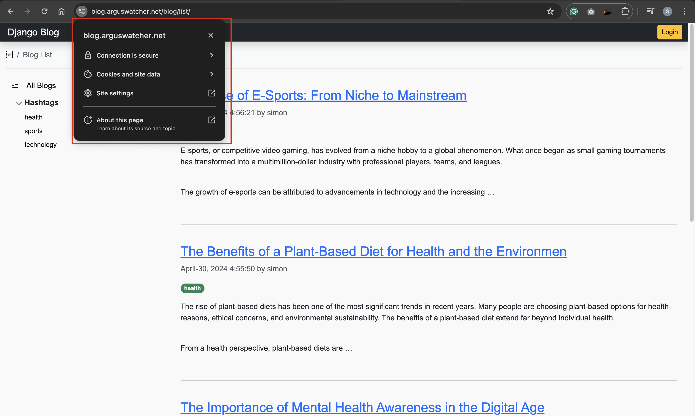

# DjangoBlog - Deploy on EC2: Enable HTTPS using ACM

[Back](../../README.md)

- [DjangoBlog - Deploy on EC2: Enable HTTPS using ACM](#djangoblog---deploy-on-ec2-enable-https-using-acm)
  - [Introduction](#introduction)
  - [Enabling HTTPS with ACM](#enabling-https-with-acm)
  - [Debugging CSRF Verification Failed](#debugging-csrf-verification-failed)
  - [Testing HTTPS](#testing-https)
  - [Summary](#summary)

---

## Introduction

Securing web application with HTTPS improves security and user trust. This document outlines the process of enabling `HTTPS` using `AWS Certificate Manager` (`ACM`), `Application Load Balancer` (`ALB`), and `Amazon Route 53`. By creating an `SSL/TLS` certificate in `ACM`, setting up an `ALB` with listeners for `HTTP` and `HTTPS`, and updating `DNS` records in `Route 53`, the application can establish secure connections. Configuring `CSRF` verification within the application ensures smooth operation. This process provides a safer and more reliable experience for users.

---

## Enabling HTTPS with ACM

- Create a certificate in `AWS Certificate Manager` (`ACM`), to obtain an `SSL/TLS` certificate to secure communication with the application.



- Create target group to route traffic to the appropriate EC2 instances.



- Create `Application Load Balancer`(`ALB`) to manage and distribute incoming traffic.



Add 2 listeners

- HTTP
- HTTPS



- Select certificate from `ACM` to apply the SSL/TLS certificate to the `ALB`'s `HTTPS` listener.



- Update `DNS` Records in `Amazon Route 53` to modify DNS records to route traffic to the `ALB`.



---

## Debugging CSRF Verification Failed

To resolve `CSRF` verification errors in the application, add trusted origins to the `settings.py` file. Adding trusted origins ensures that `CSRF` protection functions correctly and the application operates smoothly with the specified domains.

```py
# Define trusted origins for CSRF verification
CSRF_TRUSTED_ORIGINS = ["http://*.arguswatcher.net", "https://*.arguswatcher.net"]
```



---

## Testing HTTPS

After deploying the DjangoBlog application on EC2 with the `HTTPS` protocol, open the application URL in a web browser using the `HTTPS` protocol.





---

## Summary

This document details the process of securing the DjangoBlog application on `AWS EC2` using `HTTPS` and addressing `CSRF` verification errors.

- Enabling `HTTPS` with `ACM`: Creates an `SSL/TLS` certificate in `AWS Certificate Manager`, configures an `Application Load Balancer` with `HTTP` and `HTTPS` listeners, and updates DNS records in `Amazon Route 53`.
- Debugging `CSRF` Verification Failed: Adds trusted origins in `settings.py` to resolve `CSRF` verification errors.
- Testing `HTTPS`: Verifies secure `HTTPS` connections by accessing the application and checking for security indicators in the browser.

---

[Top](#djangoblog---deploy-on-ec2-enable-https-using-acm)
