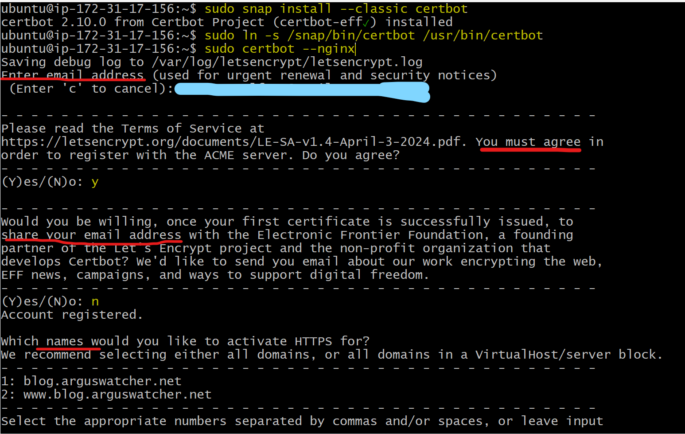
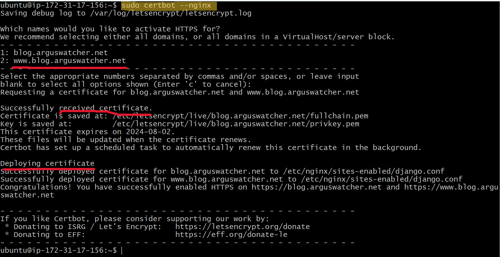
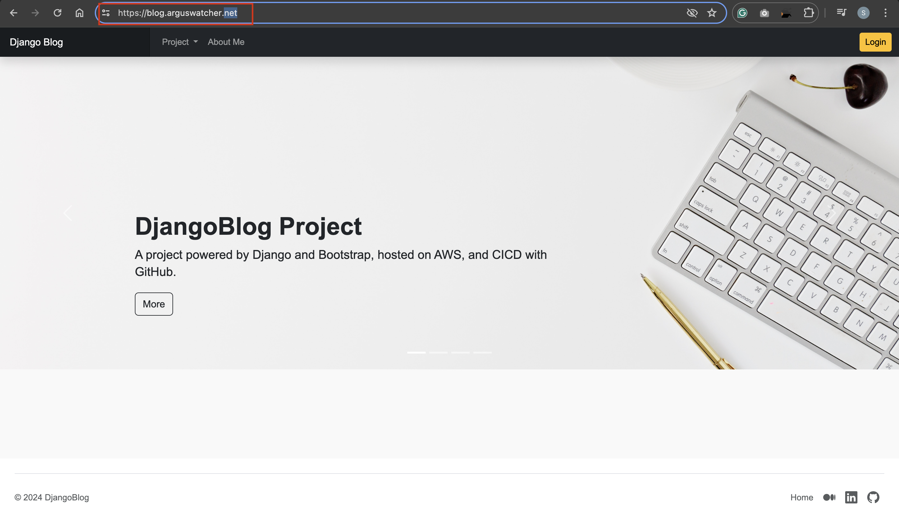
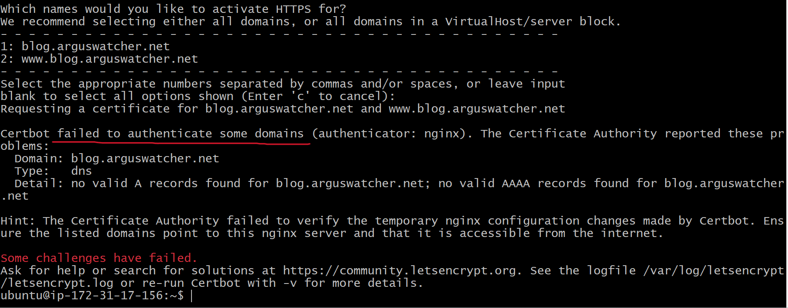
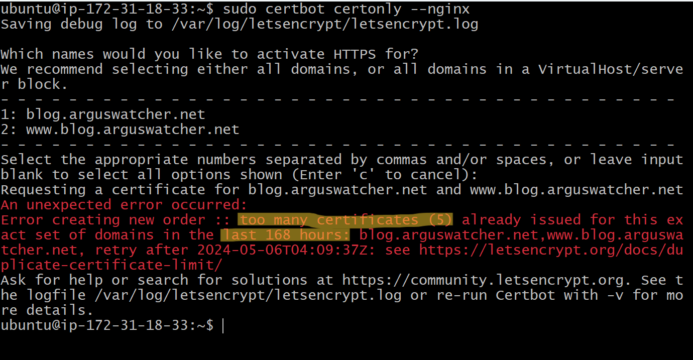

# DjangoBlog - Deploy on EC2: Enable HTTPS using certbot

[Back](../../README.md)

- [DjangoBlog - Deploy on EC2: Enable HTTPS using certbot](#djangoblog---deploy-on-ec2-enable-https-using-certbot)
  - [Introduction](#introduction)
  - [Install Snapd and Certbot](#install-snapd-and-certbot)
  - [Confirm that Certbot worked](#confirm-that-certbot-worked)
  - [Troubleshooting](#troubleshooting)

---

## Introduction

Securing a website connection using `HTTPS` is essential for protecting data confidentiality and integrity. This document outlines the process of enabling `HTTPS` using the `Certbot` package and `Let's Encrypt` certificates.

---

## Install Snapd and Certbot

- Install `Snapd`

`Snapd` is a package management system for Linux that enables to install and manage applications through snaps—self-contained packages that include all dependencies.

For more information about snaps, refer to the **Snapcraft Documentation**: https://snapcraft.io/docs

```sh
# Install the snapd package
sudo apt install -y snapd
```

- Install `Certbot`

`Certbot` is an open-source software tool that enables `HTTPS` by automatically managing `Let's Encrypt` certificates for manually administered websites.

```sh
# Install Certbot
sudo snap install --classic certbot

# Create a symbolic link to ensure the certbot command can be run
sudo ln -s /snap/bin/certbot /usr/bin/certbot
```

- Install Certificates

Obtain an `SSL` certificate and have `Certbot` configure the `Nginx` server for `HTTPS` access in one step

```sh
# Obtain and install SSL certificates, and configure Nginx
sudo certbot --nginx
```

`Certbot` will guide through the process of obtaining a certificate and configuring `Nginx` to serve it.





---

## Confirm that Certbot worked

To confirm that web site is set up properly, visit domain in browser.



---

## Troubleshooting

Before configuring the certificate, make sure to update the DNS record to point to the server. Failure to do so can lead to verification errors when Certbot attempts to validate the domain.verification failure.



Another common error arises when too many certificates are requested within a short period. If multiple certificates have been created within the last 168 hours (one week), `Certbot` will raise an error. To avoid this, carefully manage the frequency of certificate requests.



---

[TOP](#djangoblog---deploy-on-ec2-enable-https-using-certbot)
